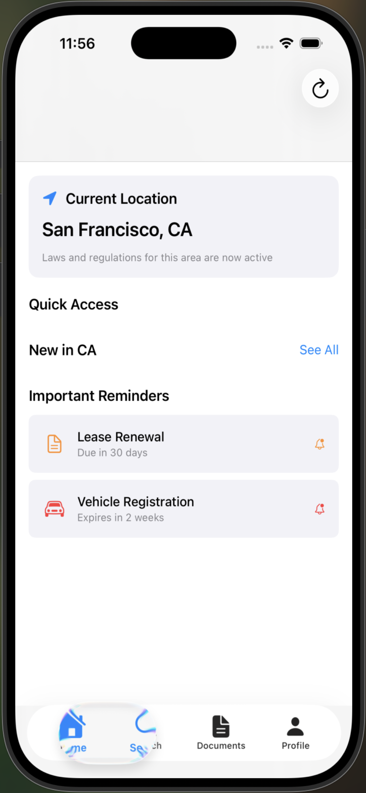
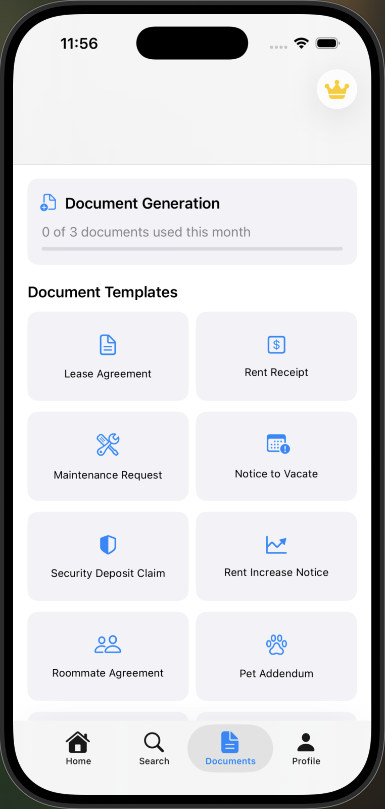
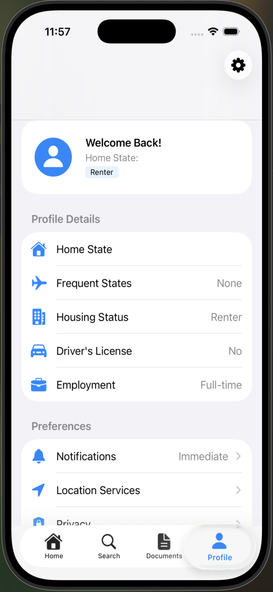
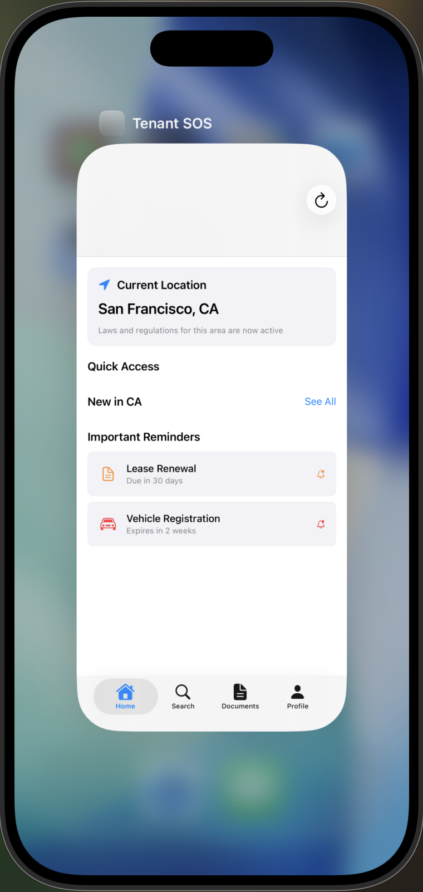

# Tenant SOS - Legal Rights Guide 🛡️

<div align="center">
  


  **Your Personal Legal Assistant for State Laws & Tenant Rights**

  [](https://www.apple.com/ios/)
  [](https://swift.org)
  [](https://developer.apple.com/xcode/swiftui/)
  [](https://firebase.google.com)
</div>

## 📱 About Tenant SOS

Tenant SOS is a comprehensive iOS application that provides instant access to state-specific legal information, tenant rights, and legal document generation. As users travel between states, the app automatically detects their location and provides relevant local laws, ensuring they're always informed of their rights and responsibilities.

### 🎯 Problems We Solve

- **Legal Confusion Across States**: Different states have vastly different laws regarding tenant rights, traffic regulations, and employment rules
- **Lack of Accessible Legal Information**: Legal documents and statutes are often written in complex language that's hard to understand
- **Document Generation Complexity**: Creating legal documents like lease agreements or notices requires expertise most people don't have
- **Staying Updated**: Laws change frequently, and it's difficult to stay informed about updates that affect you

## ✨ Key Features

### 🗺️ Location-Based Legal Information
- **Automatic State Detection**: Uses GPS to identify your current state
- **Real-time Law Updates**: Get relevant laws for your current location
- **State Comparison**: Compare laws between your home state and current location
- **Offline Access**: Download laws for offline reference while traveling

### 📚 Comprehensive Legal Database
- **Tenant Rights**: Detailed information about rental laws, security deposits, eviction procedures
- **Traffic Laws**: State-specific traffic regulations, fines, and penalties
- **Employment Laws**: Minimum wage, overtime rules, worker protections
- **Consumer Rights**: Return policies, warranty laws, consumer protections
- **Tax Information**: State tax rates and filing requirements

### 📄 Document Generator
- **10+ Legal Templates**: Pre-built templates for common legal documents
- **Smart Form Filling**: Guided forms with validation
- **PDF Export**: Generate professional PDF documents
- **Cloud Storage**: Save documents to iCloud for access across devices

### 🔔 Smart Notifications
- **Location Change Alerts**: Notified when entering a new state with different laws
- **Law Update Notifications**: Stay informed about changes to laws that affect you
- **Document Deadline Reminders**: Never miss important legal deadlines
- **Customizable Alerts**: Choose what types of updates you want to receive

### 👤 User Profile & Preferences
- **Multi-State Profiles**: Track laws for states you frequently visit
- **Housing Status Tracking**: Customize information based on renter/owner status
- **Employment Type Settings**: Get relevant employment laws for your situation
- **Notification Preferences**: Control frequency and types of alerts

## 🏗️ Technical Architecture

### Technology Stack
- **Language**: Swift 5.9+
- **UI Framework**: SwiftUI
- **Minimum iOS**: iOS 16.0+
- **Database**: Core Data with CloudKit sync
- **Backend**: Firebase (Analytics, Auth, Firestore, Crashlytics)
- **Location**: Core Location framework
- **Documents**: PDFKit for document generation

### Project Structure
```
Tenant-SOS/
├── Tenant-SOS/
│   ├── Managers/
│   │   ├── LocationManager.swift      # GPS and location services
│   │   ├── DataController.swift       # Core Data management
│   │   ├── NotificationManager.swift  # Push notifications
│   │   ├── StoreManager.swift        # In-app purchases
│   │   └── UserProfileManager.swift  # User preferences
│   ├── Views/
│   │   ├── Dashboard/                # Home screen views
│   │   ├── Search/                   # Law search interface
│   │   ├── Documents/                # Document generation
│   │   ├── Profile/                  # User settings
│   │   └── Onboarding/              # First-launch experience
│   ├── Services/
│   │   └── DocumentGenerator.swift   # PDF generation logic
│   └── Models/
│       └── CoreDataModels.swift      # Data models
├── AppStoreMetadata/                  # App Store assets
└── README.md
```

## 🚀 Getting Started

### Prerequisites
- Xcode 15.0 or later
- iOS 16.0+ device or simulator
- Firebase account for backend services
- Apple Developer account (for device testing)

### Installation

1. **Clone the repository**
```bash
git clone https://github.com/Mac-Huang/Tenant-SOS.git
cd Tenant-SOS
```

2. **Open in Xcode**
```bash
open Tenant-SOS/Tenant-SOS.xcodeproj
```

3. **Configure Firebase**
- Create a new Firebase project at [console.firebase.google.com](https://console.firebase.google.com)
- Add an iOS app with bundle ID: `com.tenantsos.app`
- Download `GoogleService-Info.plist` and add to the project
- Enable Authentication, Firestore, and Analytics

4. **Install Dependencies**
- In Xcode: File → Add Package Dependencies
- Add Firebase SDK: `https://github.com/firebase/firebase-ios-sdk`
- Select: FirebaseAnalytics, FirebaseAuth, FirebaseFirestore, FirebaseCrashlytics

5. **Build and Run**
- Select a simulator or device
- Press ⌘+R to build and run

## 💰 Monetization

### Freemium Model
- **Free Tier**:
  - Access to basic state laws
  - 3 document generations per month
  - Home state information only

- **Pro Subscription ($4.99/month)**:
  - Unlimited document generation
  - All 50 states coverage
  - Priority law updates
  - Advanced search features
  - Export and sharing capabilities

## 📸 Screenshots

<div align="center">
  
  
</div>

<div align="center">
  
  
</div>

## 🗺️ Roadmap

### Version 1.0 (Current)
- ✅ Core app functionality
- ✅ 5 initial states (CA, TX, NY, FL, IL)
- ✅ Basic document templates
- ✅ Location-based notifications

### Version 1.1
- [ ] 10 additional states
- [ ] Advanced search filters
- [ ] Document versioning
- [ ] Bookmark synchronization

### Version 1.2
- [ ] Apple Watch companion app
- [ ] Siri Shortcuts integration
- [ ] Widget support
- [ ] Document collaboration

### Version 2.0
- [ ] AI-powered legal assistant
- [ ] Natural language search
- [ ] All 50 states coverage
- [ ] Legal professional network

## 🤝 Contributing

We welcome contributions! Please see our [Contributing Guidelines](CONTRIBUTING.md) for details.

### How to Contribute
1. Fork the repository
2. Create a feature branch (`git checkout -b feature/AmazingFeature`)
3. Commit your changes (`git commit -m 'Add some AmazingFeature'`)
4. Push to the branch (`git push origin feature/AmazingFeature`)
5. Open a Pull Request

## 📄 License

This project is licensed under the MIT License - see the [LICENSE](LICENSE) file for details.

## 🙏 Acknowledgments

- **Firebase** for backend infrastructure
- **Apple** for the iOS platform and development tools
- **Contributors** who help improve the app
- **Users** who provide valuable feedback

## 📞 Contact

**Mac Huang** - Project Owner

- GitHub: [@Mac-Huang](https://github.com/Mac-Huang)
- Project Link: [https://github.com/Mac-Huang/Tenant-SOS](https://github.com/Mac-Huang/Tenant-SOS)

## ⚠️ Legal Disclaimer

Tenant SOS provides general legal information and document templates. This app does not provide legal advice, and the information contained within should not be construed as such. For specific legal questions or concerns, please consult with a qualified attorney in your jurisdiction.

---

<div align="center">
  Made with ❤️ for renters and travelers across America
</div>
